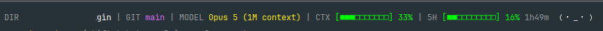

# claude-statusline-astro

Claude Code 화면 맨 아래에 **지금 상태를 한 줄로** 보여 줍니다.



작업 중인 폴더, git 브랜치, 쓰는 모델, 대화가 얼마나 찼는지, 5시간 한도가 얼마나 남았는지. 그리고 줄 끝에는 **내 마스코트**가 앉아 있습니다. 하루에 한 번 뽑을 수 있는 얼굴입니다.

Windows, macOS, Linux 어디서 써도 같은 모양입니다.

> 개인이 만든 프로젝트입니다. Anthropic과는 관계가 없습니다.

<br>

| | 바로 가기 |
| --- | --- |
| 1 | [설치](#1-설치) |
| 2 | [마스코트 뽑기](#2-마스코트-뽑기) |
| 3 | [명령어](#3-명령어) |
| 4 | [화면 읽는 법](#4-화면-읽는-법) |
| 5 | [마스코트 도감](#5-마스코트-도감) |
| 6 | [옵션](#6-옵션) |
| 7 | [안 될 때](#7-안-될-때) |
| 8 | [업데이트와 삭제](#8-업데이트와-삭제) |

<br>

## 1. 설치

### Claude Code 안에서

Claude Code를 열고, 채팅창에 아래 세 줄을 **한 줄씩** 입력합니다.

```
/plugin marketplace add black-astro/claude-statusline-astro
```
```
/plugin install statusline@black-astro
```
```
/statusline-install
```

### 터미널에서

Windows (PowerShell):

```powershell
irm https://raw.githubusercontent.com/black-astro/claude-statusline-astro/main/install.ps1 | iex
```

macOS, Linux, WSL:

```sh
curl -fsSL https://raw.githubusercontent.com/black-astro/claude-statusline-astro/main/install.sh | sh
```

### 설치 후

**Claude Code를 완전히 닫았다가 다시 여세요.** 그래야 줄이 나타납니다.

설치는 홈 폴더의 `.claude` 폴더 안에만 이루어집니다. 스크립트 몇 개가 복사되고 `settings.json`에 필요한 항목이 더해집니다. 원래 있던 설정은 그대로 두고, `settings.json.bak`으로 백업도 남깁니다.

| 운영체제 | 홈 폴더의 `.claude` |
| --- | --- |
| Windows | `C:\Users\사용자이름\.claude\` |
| macOS | `/Users/사용자이름/.claude/` |
| Linux | `/home/사용자이름/.claude/` |

아래에서 `~/.claude/`라고 적힌 곳은 모두 이 폴더입니다.

<br>

## 2. 마스코트 뽑기

설치 직후에는 마스코트가 없습니다. 한 번 뽑아야 나타납니다.

```
/statusline-roll
```

```
오늘의 마스코트를 뽑았습니다!

  （◕‿◕）✧  Glow  [레어 3/12]
  표정 2장  （◕‿◕）✧ （◠‿◠）✦
  대사      다 됐어요 / 끝났어요 / 완료했어요 / 해냈어요! / 준비 끝!

다음 뽑기는 내일부터 가능합니다.
```

얼굴마다 영어 이름이 하나씩 있습니다. 위 예시라면 `Glow`입니다.

- 뽑기는 **하루에 한 번**입니다.
- 뽑지 않으면 지금 얼굴이 **그대로** 남습니다. 저절로 바뀌지 않습니다.
- 어떤 프로젝트, 어떤 터미널, 새로 연 세션에서도 **같은 얼굴**이 나옵니다.

<br>

## 3. 명령어

| 입력 | 하는 일 |
| --- | --- |
| `/statusline-roll` | 마스코트 뽑기 (하루 한 번) |
| `/statusline-today` | 지금 내 마스코트와 이름 보기 |
| `/statusline-update` | 최신 버전으로 업데이트 |
| `/statusline-install` | 설치, 재설치 |
| `/statusline-help` | 짧은 도움말 |

터미널에서도 됩니다.

```sh
# macOS · Linux · WSL
~/.claude/mascot roll        # 뽑기
~/.claude/mascot             # 지금 마스코트
```

```powershell
# Windows
~\.claude\mascot.cmd roll    # 뽑기
~\.claude\mascot.cmd         # 지금 마스코트
```

<br>

## 4. 화면 읽는 법

```
DIR my-project | GIT main | MODEL Opus 5 | CTX [◼◼◻◻◻◻◻◻◻◻] 21% | 5H [◼◼◼◻◻◻◻◻◻◻] 34% 1h49m （◕‿◕）✧
```

| 항목 | 뜻 |
| --- | --- |
| `DIR` | 작업 중인 프로젝트 폴더 |
| `GIT` | 브랜치. `main`과 `master`는 보라색, 나머지는 하늘색 |
| `MODEL` | 쓰는 모델 |
| `CTX` | 대화가 얼마나 찼는지. 100%에 가까워지면 앞쪽 대화가 정리됩니다 |
| `5H` | 5시간 사용 한도. 뒤의 `1h49m`은 한도가 새로 시작되기까지 남은 시간 |
| 맨 끝 | 내 마스코트 |

게이지는 60% 미만이면 초록, 60% 이상이면 주황, 90% 이상이면 빨강입니다.

`CTX`는 세션마다 따로 셉니다. `5H`는 계정 전체가 함께 쓰는 값이라 어느 터미널에서나 같습니다. 잠깐 뒤처진 값에는 앞에 `~`가 붙고, 메시지를 보내면 맞춰집니다.

### 마스코트가 말할 때

평소에는 얼굴만 있습니다. 세 순간에만 한마디 합니다.

| 순간 | 예 |
| --- | --- |
| Claude가 작업하는 동안 | `작업 중이에요` |
| 작업이 막 끝났을 때 (1분 동안) | `끝났어요` |
| 확인을 기다릴 때 | `확인해 주세요` |

작업하는 동안에는 표정도 번갈아 바뀝니다.

<br>

## 5. 마스코트 도감

얼굴은 **53종**, 다섯 등급입니다.

| 등급 | 확률 | 색 | 얼굴 수 |
| --- | --- | --- | --- |
| 커먼 | 40% | 옅은 회색 | 12 |
| 언커먼 | 35% | 초록 | 12 |
| 레어 | 18% | 하늘색 | 12 |
| 유니크 | 6% | 연보라에서 진보라 (고정) | 10 |
| 레전드 | 1% | 얼굴마다 다른 색이 흐름 | 7 |

확률은 누구에게나 같습니다.

### 레전드

글자 하나하나에 다른 색이 들어가고, 그 색이 계속 흘러갑니다. 얼굴마다 색이 다릅니다. 아래는 그중 한 순간입니다.

| 이름 | 얼굴 | 색 |
| --- | --- | --- |
| **Halo** |  |  |
| **Heartthrob** |  |  |
| **Bliss** |  |  |
| **Serenade** |  |  |
| **Monarch** |  |  |
| **Wrath** |  |  |
| **Overlord** |  |  |

| 이름 | 표정 |
| --- | --- |
| **Halo** | `･ﾟ✧（◕ᴗ◕）✧ﾟ･` · `･ﾟ✦（◕ᴗ◕）✦ﾟ･` · `･ﾟ✧（◕ᴗ◕）✦ﾟ･` · `･ﾟ✦（◕ᴗ◕）✧ﾟ･` |
| **Heartthrob** | `♡ヽ（♥‿♥）ノ♡` · `♥ヾ（♡‿♡）ノ♥` · `♡ヾ（♥‿♥）ノ♡` · `♥ヽ（♡‿♡）ノ♥` |
| **Bliss** | `✧ﾟ（ﾉ≧∇≦）ﾉﾟ✧` · `✦ﾟ（ﾉ≧▽≦）ﾉﾟ✦` · `✧ﾟ（ﾉ≧∇≦）ﾉﾟ✦` · `✦ﾟ（ﾉ≧▽≦）ﾉﾟ✧` |
| **Serenade** | `♪ﾟ･（๑ᴖ◡ᴖ๑）･ﾟ♪` · `♬ﾟ･（๑ᴖ◡ᴖ๑）･ﾟ♬` · `♩ﾟ･（๑ᴖ◡ᴖ๑）･ﾟ♩` · `♬ﾟ･（๑ᴖ◡ᴖ๑）･ﾟ♬` |
| **Monarch** | `･ﾟ✧（￣ヘ￣）✧ﾟ･` · `･ﾟ✦（￣ヘ￣）✦ﾟ･` · `･ﾟ✧（￣ヘ￣）✦ﾟ･` · `･ﾟ✦（￣ヘ￣）✧ﾟ･` |
| **Wrath** | `✦ﾟ（╬◣_◢）ﾟ✦` · `✧ﾟ（╬◢_◣）ﾟ✧` · `✦ﾟ（╬◢_◣）ﾟ✦` · `✧ﾟ（╬◣_◢）ﾟ✧` |
| **Overlord** | `≪✧（╬▼_▼）✧≫` · `≪✦（╬▼_▼）✦≫` · `≪✧（╬▼_▼）✦≫` · `≪✦（╬▼_▼）✧≫` |

### 유니크

연보라에서 진보라로 이어지는 색이 얼굴에 고정으로 입혀집니다. 흐르지는 않습니다.

 

| 이름 | 얼굴 | 표정 |
| --- | --- | --- |
| **Superstar** | `✧ヽ（☆▽☆）ノ✧` | `✦ヾ（★▽★）ノ✦` |
| **Jubilee** | `✧（ﾉ◕ヮ◕）ﾉ✧` | `✦（ﾉ◠ヮ◠）ﾉ✦` |
| **Lovestruck** | `✧（๑♡‿♡๑）✧` | `✦（๑♥‿♥๑）✦` |
| **Dazzle** | `✧ヽ（✧∇✧）ノ✧` | `✦ヾ（✦▽✦）ノ✦` |
| **Hurrah** | `✧＼（◕ᴗ◕）／✧` | `✦＼（◠ᴗ◠）／✦` |
| **Boss** | `✧ヽ（￣ヘ￣）ノ✧` | `✦ヾ（￣ヘ￣）ノ✦` |
| **Fury** | `✧ヽ（╬◣_◢）ノ✧` | `✦ヽ（╬◢_◣）ノ✦` |
| **Skeptic** | `✧ヽ（￢_￢）ノ✧` | `✦ヾ（￢‿￢）ノ✦` |
| **Villain** | `✧ヽ（╬￣ヘ￣）ノ✧` | `✦ヾ（╬￣ヘ￣）ノ✦` |
| **Grit** | `✧┗（⇀‸↼）┛✧` | `✦┗（⇀‸↼）┛✦` |

### 레어

하늘색.

| 이름 | 얼굴 | 표정 |
| --- | --- | --- |
| **Twinkle** | `（๑˃ᴗ˂）✧` | `（๑˂ᴗ˃）✦` |
| **Cheer** | `ヽ（•‿•）ノ` | `ヾ（•‿•）ノ` |
| **Glow** | `（◕‿◕）✧` | `（◠‿◠）✦` |
| **Hooray** | `\（^o^）/` | `\（^O^）/` |
| **Starry** | `（๑✧‿✧๑）` | `（๑✦‿✦๑）` |
| **Wave** | `ヽ（^ω^）ノ` | `ヾ（^ω^）ノ` |
| **Smug** | `（￣ｰ￣）✧` | `（￣ｰ￣）✦` |
| **Shades** | `（▼ω▼）✧` | `（▼ω▼）✦` |
| **Brat** | `（◣ω◢）✧` | `（◢ω◣）✦` |
| **Knowing** | `（￢‿￢）✧` | `（￢‿￢）✦` |
| **Starstruck** | `（★ω★）` | `（☆ω☆）` |
| **Gunslinger** | `（☞ﾟヮﾟ）☞` | `（☜ﾟヮﾟ）☜` |

### 언커먼

초록색.

| 이름 | 얼굴 | 표정 |
| --- | --- | --- |
| **Giggle** | `（๑˃ᴗ˂）` | `（๑˂ᴗ˃）` |
| **Rosy** | `（｡･ω･｡）` | `（｡-ω-｡）` |
| **Beam** | `（^▽^）` | `（^∇^）` |
| **Bright** | `（◕‿◕）` | `（◠‿◠）` |
| **Squee** | `（≧ω≦）` | `（≧▽≦）` |
| **Wink** | `（･ω<）` | `（-ω<）` |
| **Stare** | `（ㆆ_ㆆ）` | `（ㆆ.ㆆ）` |
| **Eyeroll** | `（◔_◔）` | `（◔‸◔）` |
| **Half-lid** | `（◓_◓）` | `（◒_◒）` |
| **Hamster** | `（・ㅂ・）` | `（－ㅂ－）` |
| **Sly** | `（¬‿¬）` | `（¬_¬）` |
| **Shifty** | `（◑_◑）` | `（◐_◐）` |

### 커먼

옅은 회색.

| 이름 | 얼굴 | 표정 |
| --- | --- | --- |
| **Kitten** | `（・ω・）` | `（－ω－）` |
| **Droopy** | `（´･ω･）` | `（´-ω-）` |
| **Snooze** | `（ ˘ω˘ ）z` | `（ ˘ω˘ ）Z` |
| **Whiskers** | `（=・ω・=）` | `（=－ω－=）` |
| **Grin** | `（・∀・）` | `（－∀－）` |
| **Smiley** | `（・◡・）` | `（－◡－）` |
| **Side-eye** | `（￢_￢）` | `（￢‿￢）` |
| **Meh** | `（＝_＝）` | `（＝.＝）` |
| **Blank** | `（・_・）` | `（－_－）` |
| **Smirk** | `（≖‿≖）` | `（≖_≖）` |
| **Scowl** | `（◣_◢）` | `（◢_◣）` |
| **Deadpan** | `（ー_ー）` | `（ー.ー）` |

### 대사

| 등급 | 작업 중 | 작업 끝 | 확인 요청 |
| --- | --- | --- | --- |
| 커먼 | `끙...` | `냥!` | `앙?` |
| 언커먼 | `하는 중!` | `다했다!` | `저기요!` |
| 레어 | `작업 중이에요` | `끝났어요` | `확인해 주세요` |
| 유니크 | `처리하고 있어요!` | `다 끝냈습니다!` | `확인 부탁해요!` |
| 레전드 | `작업을 진행하고 있습니다!` | `전부 끝냈습니다, 확인 부탁드려요!` | `확인 부탁드립니다!` |

<br>

## 6. 옵션

`~/.claude/settings.json`의 `env` 항목에 넣고 Claude Code를 다시 열면 적용됩니다. 예를 들어 대사 없이 얼굴만 보려면 이렇게 씁니다.

```json
{
  "env": {
    "STATUSLINE_TALK": "0"
  }
}
```

| 변수 | 값 | 하는 일 |
| --- | --- | --- |
| `STATUSLINE_MASCOT` | `0` | 마스코트 숨기기 |
| `STATUSLINE_TALK` | `0` | 얼굴만, 대사 없이 |
| `STATUSLINE_SEVEN_DAY` | `1` | 주간(7일) 사용 한도 게이지 표시 |
| `STATUSLINE_TRUE_COLOR` | `0` | 256색만 되는 터미널에서 레전드·유니크 색 맞추기 |
| `NO_COLOR` | `1` | 색 전부 끄기 |

`settings.json`에 이미 `env`가 있다면 그 안에 줄만 더하면 됩니다.

<br>

## 7. 안 될 때

**줄이 아예 안 보입니다.**
Claude Code를 완전히 닫았다가 다시 여세요. 그래도 없으면 `/statusline-install`을 한 번 더 실행하세요.

**마스코트만 안 보입니다.**
아직 안 뽑은 경우입니다. `/statusline-roll`을 입력하세요.

**마스코트가 잘리거나 줄이 두 줄로 넘어갑니다.**
터미널이 좁아서 줄 끝이 밀려난 것입니다. 창을 넓히거나, `STATUSLINE_TALK=0`으로 대사를 끄면 짧아집니다.

**글자가 네모(□)나 물음표로 나옵니다.**
터미널 폰트에 그 글자가 없는 경우입니다. D2Coding, Cascadia Code, JetBrains Mono처럼 기호가 넉넉한 폰트로 바꿔 보세요.

**`5H`가 `--%`로만 나옵니다.**
Claude.ai 구독 플랜이 아니면 사용량이 내려오지 않습니다. 나머지는 정상 동작합니다.

**색이 안 나옵니다.**
`NO_COLOR` 환경변수가 켜져 있는지 확인하세요.

**레전드·유니크 색만 이상하게 나옵니다.**
터미널이 256색까지만 지원하는 경우입니다. `STATUSLINE_TRUE_COLOR=0`으로 바꾸세요.

**레전드 색이 뚝뚝 끊겨 보입니다.**
줄은 `settings.json`의 `statusLine` 안 `refreshInterval`(초)마다 다시 그려집니다. 예전에 설치했다면 3일 수 있는데, 2로 낮추면 더 부드럽습니다.

**설치가 됐는지 확인하고 싶습니다.**

```sh
sh ~/.claude/statusline.sh --version
```
```powershell
powershell -File ~\.claude\statusline.ps1 -Version
```

버전이 나오면 정상입니다.

<br>

## 8. 업데이트와 삭제

업데이트는 Claude Code 안에서 `/statusline-update`를 입력하면 됩니다. 마스코트는 그대로 유지됩니다.

지우려면 다음을 순서대로 합니다.

1. `~/.claude/settings.json`에서 `statusLine` 항목과, `hooks` 안에서 `mascot-hook`이 들어간 항목을 지웁니다.
2. `~/.claude/` 안의 `statusline.*`, `mascot*`, `statusline-cache` 폴더를 지웁니다.
3. 플러그인으로 설치했다면 `/plugin uninstall statusline@black-astro`도 실행합니다.

<br>

## 라이선스

MIT
